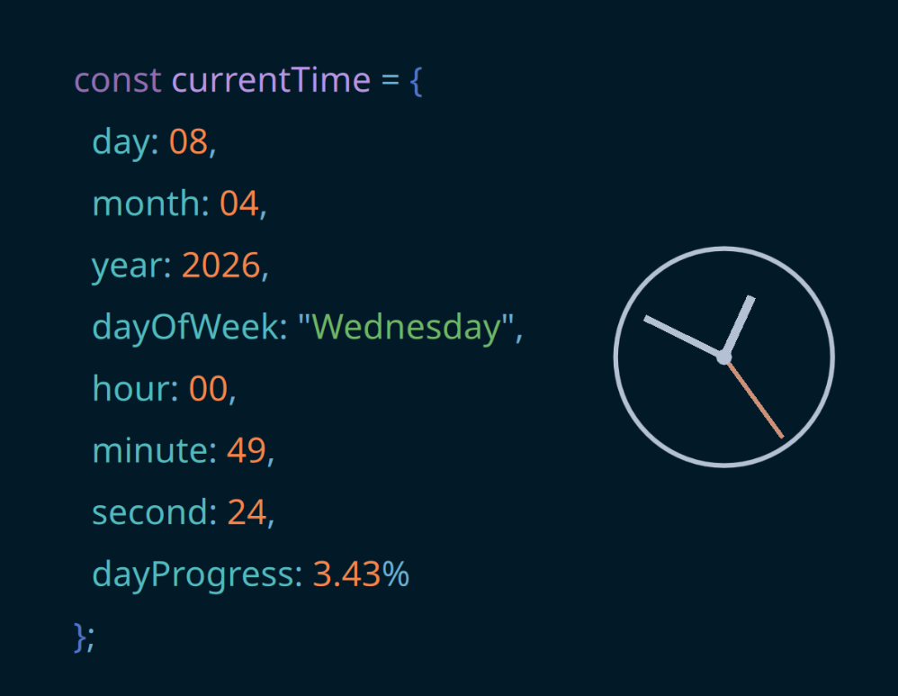

# Code Clock (KDE Plasma Widget)

Code Clock is a distinctive KDE Plasma 6 widget that displays the current date and time as a continuously updating code snippet, accompanied by a sleek analog clock. 

Perfect for developers who want their desktop to match their favorite IDE!



## Features

* **Multiple Programming Languages**: Choose to display the time in Python, JavaScript/TypeScript, C++, or C#.
* **Live Updates**: The time, date, and "day progress" variable update in real time.
* **Customizable Syntax Highlighting**: Fully personalize the colors to match your favorite editor theme. Configure colors for:
  * Declarations (e.g., `let`, `const`, `var`)
  * Variables
  * Punctuation (e.g., `=`, `:`, `,`)
  * Brackets (e.g., `{`, `}`)
  * Properties
  * Numbers
  * Strings
* **Analog Clock included**: A minimalist matching analog clock is displayed next to the code snippet.

## Requirements

* KDE Plasma 6.0 or higher

## Installation

### From Source

Clone the repository and install it using `kpackagetool6`:

```bash
git clone https://github.com/eduardandreica/codeclock.git
cd codeclock
kpackagetool6 -i .
```

To restart Plasma so the changes take effect (if needed):
```bash
systemctl restart --user plasma-plasmashell.service
```

*(Note: To upgrade an existing installation, use `kpackagetool6 -u .` instead of `-i`)*

After installation, you can add "Code Clock" to your Plasma desktop or panel like any other widget.

## Configuration

Right-click the widget and select **Configure Code Clock...** to:
1. Select your preferred programming language representation.
2. Tweak the syntax highlighting colors.
